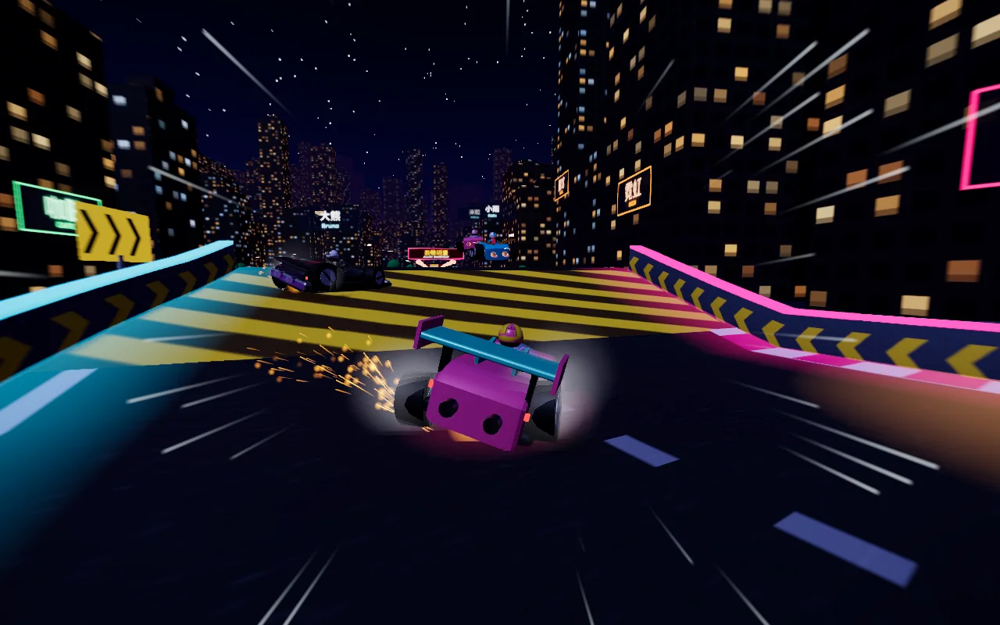
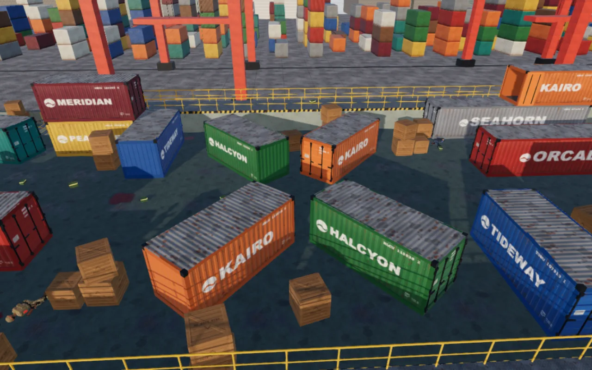
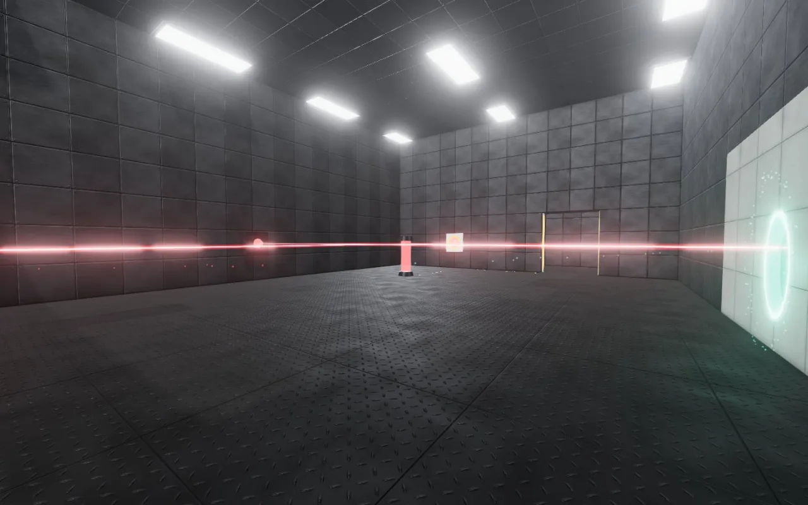
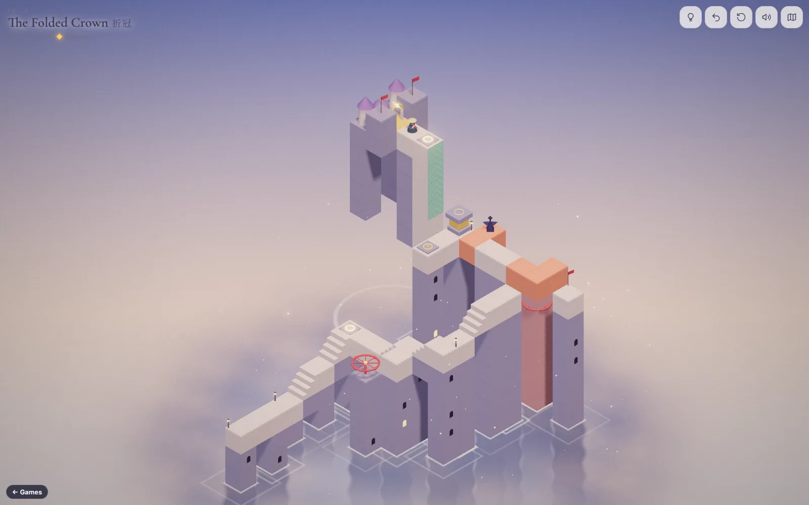
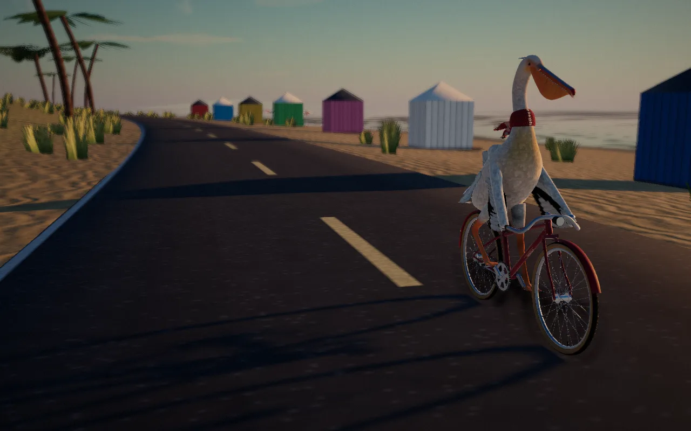
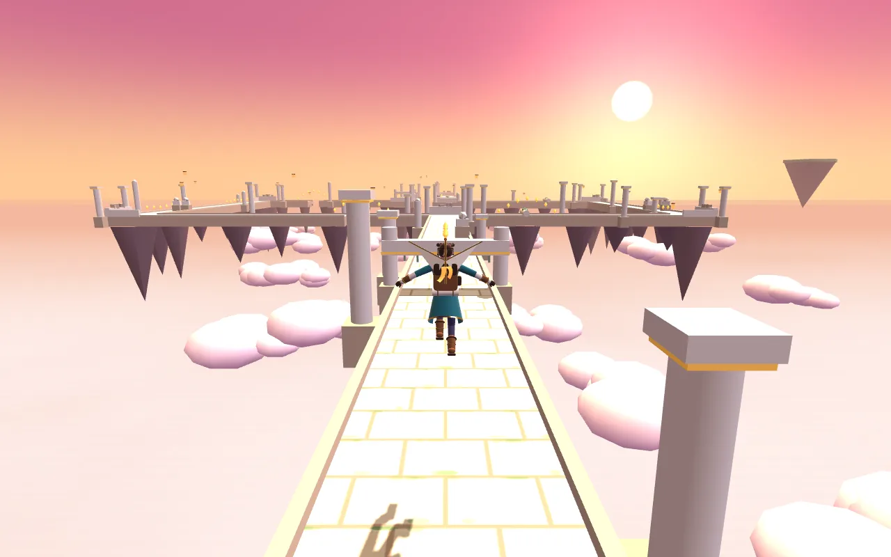

# Coin Slot Arcade

*English · [中文](README.zh-CN.md)*

**A browser arcade of eleven original games: six full 3D titles and five quick 2D cabinets.** Nothing to install and no account: open the lobby, walk down a neon arcade hall, and pick a machine. Every model, texture, level and sound is generated in code, so the whole arcade is a folder of plain HTML and JavaScript.

| | | |
|:-:|:-:|:-:|
|  **风驰 Windrift**<br>kart racing |  **Cargo Deck**<br>team shooter |  **双门 Twin Gate**<br>portal puzzles |
|  **折阶 Folded Steps**<br>impossible geometry |  **Pelican Pedal**<br>scenic ride |  **Cloudspire**<br>sky runner |

## Play in 30 seconds

**Online:** **https://mira190.github.io/coin-slot/**. Nothing to install; each game also has its own address, e.g. `…/coin-slot/games/windrift/`.

**Locally:**

The games are ES modules, so they need to be served over HTTP; opening the file directly won't work. Any static server does:

```bash
python3 -m http.server 8000      # or: npx serve .
```

Then open **http://localhost:8000**. Each game also runs on its own at `games/<id>/`, so you can bookmark or share one directly.

To put it online, upload the folder as-is to any static host (GitHub Pages, Cloudflare Pages, Netlify, S3). There's no build step.

**What you need:** a recent desktop Chrome, Edge, Firefox or Safari with WebGL 2. Phones work for most games through touch controls. Cargo Deck and Twin Gate are made for keyboard and mouse. An internet connection is used for exactly two things: three.js from the jsDelivr CDN and fonts from Google Fonts.

## The games

### Main stage: 3D

| Game | What it is | Try this |
|---|---|---|
| **风驰 Windrift** | Arcade kart racing. Four circuits (night city, windmill bay, glacier, desert pyramids), eight racers, speed, item and time-trial modes, and a drift-and-boost technique system. | Hold **Shift** through a corner, then tap **↑** the moment the boost light flashes. |
| **Cargo Deck** | A 5v5 team shooter on a moored container freighter: deathmatch or elimination rounds against bots, seven weapons and three grenade types. | Hold the bridge windows with the bolt-action sniper, or rush the flank pipe. |
| **双门 Twin Gate** | A first-person puzzle game with two linked doorways. Fifteen test trials and a rooftop escape, with an evaluator who narrates your every step. | Fall into one gate and fly out of the other at the same speed. |
| **折阶 Folded Steps** | Impossible-geometry puzzles: twelve levels where paths exist only from where you're looking. Includes a level workshop with a built-in solver. | Turn a crank until two far-apart ledges line up on screen, then walk across. |
| **Pelican Pedal** | A great white pelican on a bicycle, circling a coastal island below snowy peaks, from sunrise to the Milky Way. Half a ride, half a camera showcase. | Press **P** for photo mode and scrub the time of day to sunset. |
| **Cloudspire** | An endless runner across broken causeways above a sea of clouds, with a storm spirit on your heels. | Bank shards and spend 100 on a shielded start. |

### Mini cabinets: 2D

| Game | Genre | Controls |
|---|---|---|
| **Neon Circuit** | Night-traffic racer | ← → steer, ↓ brake, Space nitro |
| **Coil** | Snake | Arrow keys (up to two turns queue) |
| **Stackfall** | Falling-block puzzle | ← → move, ↑ rotate, ↓ soft drop, Space hard drop |
| **Brickstorm** | Brick breaker | Mouse or ← → to steer, Space to launch |
| **Lantern Drift** | One-tap flyer | Space, ↑ or tap to lift |

All five cabinets support swipe and tap on phones, **P** to pause, and remember your high score.

<details>
<summary><b>Full controls for the 3D games</b></summary>

**风驰 Windrift**: ↑ accelerate (tap on the boost light for a micro-boost) · ↓ brake · ← → steer · **Shift** drift · **Ctrl** or **Space** nitro / item 1 · **Z / X** items · **R** back on track · **C** camera · **Esc** pause · **M** mute. Gamepads and touch are supported. With WASD, use Space for nitro, because browsers don't let a page block Ctrl+W.

**Cargo Deck**: **WASD** move · mouse look (click to lock the pointer) · left click fire · right click aim/scope · **Shift** walk quietly · **C/Ctrl** crouch · **Space** jump · **R** reload · **1–4** primary / pistol / knife / grenade · **G** grenade type · **Q** last weapon · **F** inspect · **Tab** scoreboard · **Esc** settings.

**双门 Twin Gate**: mouse look · left click / **Q** first gate (or throw a held block) · right click second gate (or drop it) · **WASD** move · **Space** jump · **E** pick up / use · **R** restart the trial · **Esc** pause · **M** mute.

**折阶 Folded Steps**: click or tap a tile to walk there · drag red handles to turn or slide mechanisms · **Tab** + **Q/E** does the same from the keyboard · **Z** undo · **R** restart · **H** hint · **Esc** map.

**Pelican Pedal**: **W/↑** pedal · **S/↓** brake · **A D / ← →** steer · **F** open the pouch wide · **Space** hop · **Shift** wing-lift wheelie · **B** bell · **C** or **1–5** cameras · **P** photo mode · **H** hide the HUD · **Esc** settings.

**Cloudspire**: ← → change lane, or turn at corners · ↑ / **Space** jump · ↓ slide · swipe on touch screens.

</details>

## How it's put together

```
index.html             the lobby: a live 3D arcade hall that lists every game
arcade/                shared pieces: the game catalog, lobby, 2D cabinet engine, styles
games/<id>/            one folder per game, each playable on its own
  index.html + src/      3D games: native ES modules, three.js via an import map
  game.js                2D games: one module that runs inside the shared cabinet
  card.js                the 3D game's lobby card (title, animated preview, high score)
  poster.webp            lobby artwork (plus a short preview.webm where available)
```

- **No build step, no dependencies to install.** Everything is hand-written JavaScript. The 3D games use [three.js](https://threejs.org) r186, loaded from a CDN.
- **Generated, not downloaded.** Terrain, buildings, characters, textures and every sound effect and music loop are produced at runtime, with no image or audio assets. The posters are real screenshots, used only by the lobby.
- **Private by default.** There's no analytics, no accounts and no server. High scores and settings stay in your browser's local storage.
- **Adding a game** takes a folder and one line: put the game in `games/<id>/` and add `{ id: '<id>' }` to `arcade/registry.js`. A 3D game provides `index.html` and a `card.js`; a 2D game provides a `game.js` for the shared cabinet.

## About the games

Every title, character, level, map, model, texture and sound here was created for this project. The games draw on familiar genres (kart racing, team shooters, portal and impossible-geometry puzzles, endless runners and classic arcade formats) but use no names, artwork, levels or other material from any existing game.

## License

[MIT](LICENSE) © 2026 Mira Wu. You're free to play, study, modify and reuse the code, including in your own projects, as long as the license notice comes along. three.js (used from its CDN) is MIT-licensed by its authors; the fonts are served by Google Fonts under their own open licenses.
